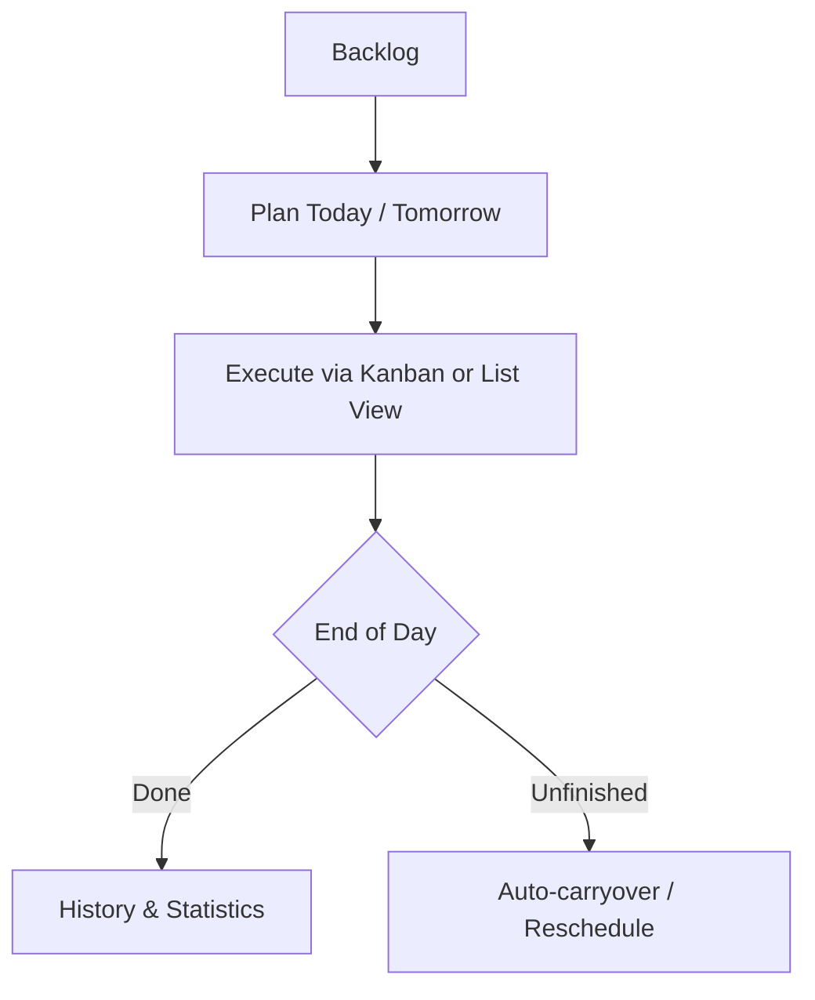

# Carpe Diem

<picture>
  <source media="(prefers-color-scheme: dark)" srcset="assets/github/subtitle-light-text.png">
  <source media="(prefers-color-scheme: light)" srcset="assets/github/subtitle-dark-text.png">
  
</picture>

A structured local-first day-by-day planner built with Flutter to manage multiple projects with high variety and zero friction.

## Design Philosophy

Carpe Diem is built upon 3 important design philosophies:

1. 📅 **Plan Day-by-Day**: Focus on today and tomorrow, with a maximum 7-day planning window to prevent task hoarding.
2. 🗂️ **Multi-Project Agility**: Organize tasks across isolated projects with labels, priorities, and deadlines.
3. 🚀 **Productivity First**: No Electron bloat, native fast performance, highly optimized UI for keyboard navigation and quick input.

---

## Main Workflow



---

## Features

- 📅 **7-Day Planning Window**: Plan for today, tomorrow, or up to a week ahead with automatic carryover for overdue tasks.
- 📋 **Flexible Daily Views**: Switch between a 3-column Kanban board (To Do, In Progress, Done) and a compact list view.
- 🗂️ **Projects & Backlog**: Keep backlog tasks organized by project and partitioned by labels until you're ready to schedule them.
- 🌲 **Subtasks**: Break complex tasks down into smaller actionable steps.
- 🏷️ **Labels & #Tags**: Categorize by project labels and flexible inline `#tags`.
- 🚫 **Task Blockers**: Mark dependencies to see which prerequisites must be finished first.
- 📊 **History & Insights**: Review completed work and track completion trends across custom time ranges.
- 📥 **Markdown Import**: Import task lists directly from `.md` files into projects.
- 🔒 **Local-First**: All data is stored locally on your device in SQLite—fast, offline, and private.

## Platforms

- **Desktop (Primary)**: Linux, Windows, macOS.

>[!NOTE]
>The app is tested on Linux and Windows, but because of Flutter's nature it should also work on macOS.

- **Mobile & Web (Planned)**: Android and iOS layouts planned (see [ROADMAP.md](./ROADMAP.md)).

## Getting Started

### Prerequisites

- Latest stable Flutter SDK
- Platform C++ build toolchains for your target platform

### Run Locally

```bash
flutter pub get
flutter run
```

### Testing & Code Quality

```bash
flutter test
flutter analyze
```

## Goals

The main goal of this project was to have a planning app that follows a strict "one day at a time" mindset. 

I also hate Electron apps gobbling up my RAM, so choosing Flutter was a no-brainer for me. The app should 
serve its purpose without unnecessary bloat and still be cross-platform.

Another goal was not to include too many 'unnecessary' features. 
No need for every possible feature under the sun. Just the essentials, done right.

## Contributing

Contributions are welcome! Please feel free to submit a Pull Request or request new features.
The more people use this app, the more it can be improved for the good of everyone.
Read more about it in the [CONTRIBUTING.md](./CONTRIBUTING.md) file.
Track version releases in [CHANGELOG.md](./CHANGELOG.md).
